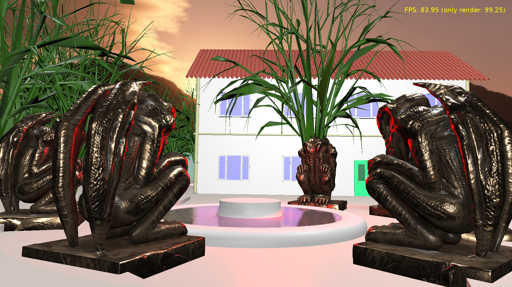

# Lynch

Cat-astrophe Games Gamejam 2022-12-16.

- Move with AWSD.
- Right click to toggle mouse look.
- Press F5 to make a screenshot.

Using [Castle Game Engine](https://castle-engine.io/).

## Screenshots

## Building

Compile by:

- [CGE editor](https://castle-engine.io/manual_editor.php). Just use menu item _"Compile"_.

- Or use [CGE command-line build tool](https://castle-engine.io/build_tool). Run `castle-engine compile` in this directory.

- Or use [Lazarus](https://www.lazarus-ide.org/). Open in Lazarus `lynch_standalone.lpi` file and compile / run from Lazarus. Make sure to first register [CGE Lazarus packages](https://castle-engine.io/documentation.php).

## Summary

Goal was:

- A short "walking simulator" with simple puzzles.
- The main feature: a 3D house surrounded by some foliage, with "night time" lighting (lanterns, hard shadows, starry sky, chirp-chirp and wind blowing sfx).
- The main work will be modeling in Blender.
- In Castle Game Engine: a simple setup of scenes, sounds, mirrors and puzzles and testing that it looks as good as in Blender.

Results:

- 3D house and surroundings, with sensible proportions.
- After gamejam small additions:
    - Sounds: Ambience, footsteps, statues.
    - Simple mechanics of creepy statues.

## TODO

Graphics:
- Tree model has to be replaced with something better. Current tree is just autogenerated and brutally simplified with Decimate, looks bad.
- Maybe add additional bushes, to have really a lot of foliage.
- Materials, textures.
- Shadows.
- Night sky (stars, moon) skybox.
- Lanterns, bright but very local lights.
- Overall: "night aura" feeling is missing, it's at best a late desaturated sunset.
- Fountain and lake - mats mirrors.
- Roof looks bad after Decimate, it should be made low-poly by correctly modelling very low-poly pieces.

Sound effects:
- Chirp-chirp?
- Wind blowing?

Code:
- Game mechanics; now there's nothing interactive.
    - Additional weird part in-house was planned.
    - We wanted puzzle to open the gate, to get key to house, to pass the hall of mirrors...
